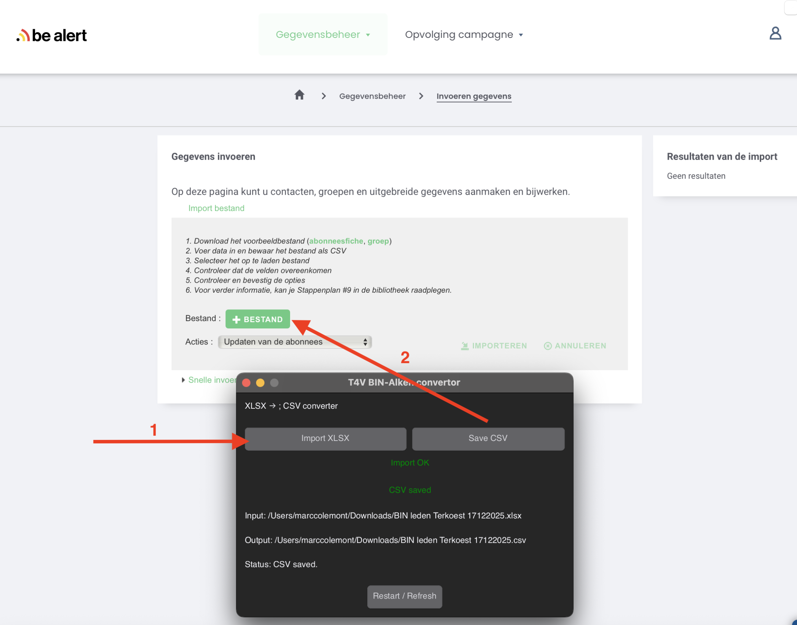

# BE-Alert BIN-Convertor xlsx-to-csv
Convertor to convert new BIN members xlsx file to a BE-Alert compatible BIN - CSV file 

Reads XLSX columns (required):
 - Voornaam
 - Naam
 - Straat
 - Huisnummer
 - Mobiel nummer
 - E-mailadres
 
Outputs BE-Alert BIN NEW CSV format (33 columns):
- Load the XLSX file
- Convert and save the exported BE-ALert compatible CSV file
- Import CSV file to import new members
  

  

File format tested with alken.be xlsx files

Tools4Video BV All Rights reserved

Copyright (c) 2025 Tools4Video 

Developer Marc Colemont
